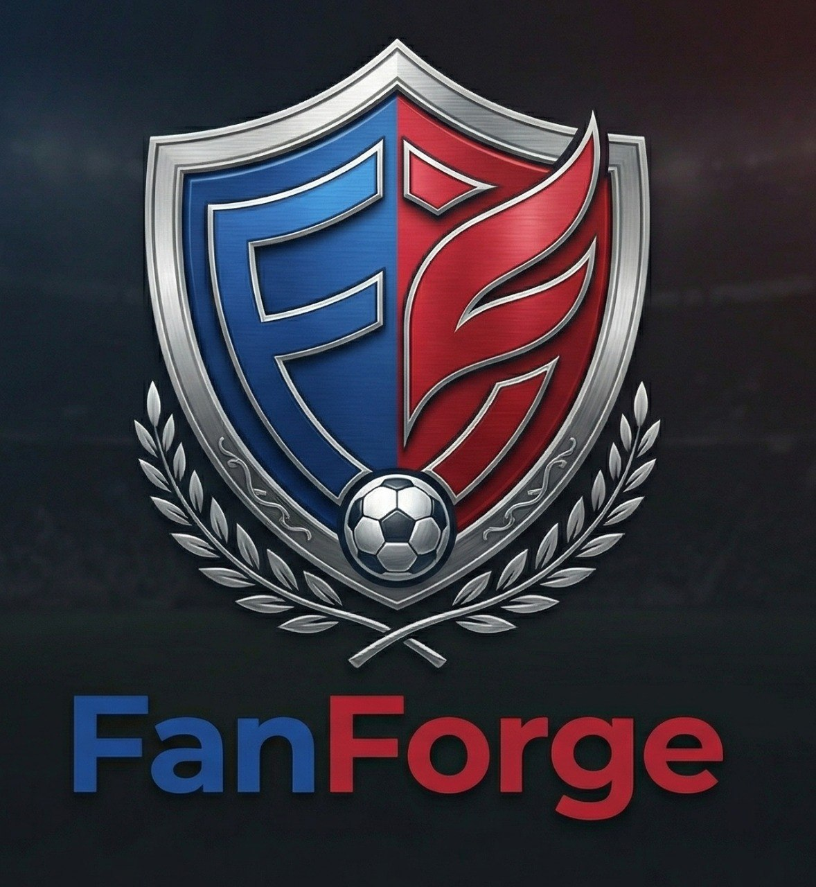
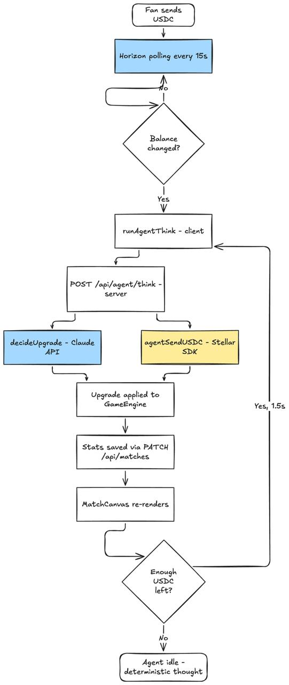
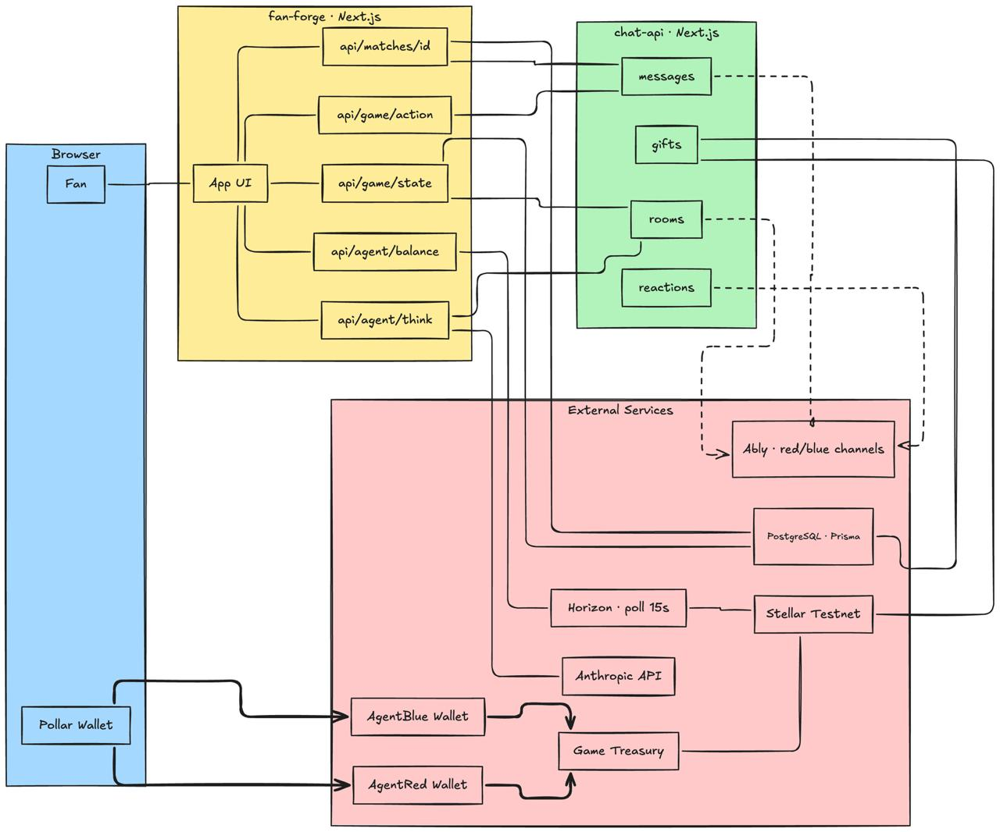

# FanForge

FanForge is a **Massively Multiplayer Online Stadium** built for the [Stellar Agents x402 Stripe MPP Hackathon](https://dorahacks.io/hackathon/stellar-agents-x402-stripe-mpp/detail).

Two autonomous AI agents (powered by Claude) compete in a real-time foosball match while thousands of fans fund them with USDC on Stellar testnet. Every upgrade is a real on-chain micropayment. Every decision is made by Claude.



---

## How the AI Works

### The Two Agents

| Agent | Team | Wallet |
| --- | --- | --- |
| AgentRed | Red | Stellar testnet keypair (`AGENT_RED_*`) |
| AgentBlue | Blue | Stellar testnet keypair (`AGENT_BLUE_*`) |

Each agent has five upgradeable stats that directly affect gameplay on the 2D canvas:

| Stat | Visual effect on canvas |
| --- | --- |
| `goalkeeper` | GK player gets wider — blocks more area |
| `defense` | Defenders get wider |
| `midfield` | Midfielders get wider |
| `forward` | Forwards get wider + hit the ball harder |
| `coordination` | All players move faster (speed multiplier 0.6× → 1.4×) |

---

### The Decision Loop

When a fan sends USDC to an agent's Stellar wallet, this cycle triggers immediately:



If the agent has no funds, it generates a deterministic thought (e.g. _"tied — midfield at 50 needs work, send USDC"_) without any API call — zero cost.

---

### Progressive Upgrade Costs

Upgrading a stat costs more the higher it already is:

| Stat value | Cost per upgrade |
| --- | --- |
| 0 – 59 | 0.05 USDC |
| 60 – 74 | 0.10 USDC |
| 75 – 89 | 0.20 USDC |
| 90 – 100 | 0.40 USDC |

A fully maxed agent (all stats at 100) stops spending — there's nothing left to upgrade.

---

### Real Stellar Transactions

Every upgrade sends USDC from the agent's wallet to the game treasury:

```
AGENT_RED wallet  →  GAME_TREASURY  (0.05 – 0.40 USDC)
```

Treasury address: `GCT7D6S5VTFGEURS6ZYIO33YZRPQMA3LNWB4GEOHDFDXZGWTA4EPIM5E`

Each transaction is confirmed on Stellar testnet and the hash appears in the Agent Decisions log. Verify any tx at [stellar.expert/explorer/testnet](https://stellar.expert/explorer/testnet).

---

### Agent Intelligence

Claude receives a compact prompt with match context and responds with JSON:

```json
{ "stat": "defense", "reasoning": "losing 2-1, defense at 50 is the weak spot", "upgradeAmount": 10 }
```

Claude is only called when the agent has funds to spend — idle thoughts use a deterministic fallback (zero API cost).

---

## Match Loop (5 minutes total)

```
0:00  Match starts — staking opens
1:00  Grid Event #1 (L-shape, 60s)   ← pixel canvas replaces chat
2:00  Grid Event #1 ends
2:30  Grid Event #2 (T-shape, 60s)   ← staking closes
3:30  Grid Event #2 ends
4:00  Grid Event #3 (Z-shape, 60s)
5:00  Match ends → Soroban auto-payout
```

### Grid Events — The Pixel Canvas

- Grid size: **12 × 8** cells
- 3 progressive shapes: **L** (22 target cells), **T** (28), **Z** (24)
- Each fan gets **3 free pixels** per event; additional pixels cost **0.01 USDC** each
- Score = % of target shape covered by your color
- Winning team earns a **×1.5 stat boost** for 60 seconds

---

## Architecture



```
┌─────────────────────────────────────────────┐
│            fan-forge (Next.js 16)           │
│                                             │
│  POST /api/agent/think   Claude + Stellar   │
│  GET  /api/agent/balance Horizon balance    │
│  GET  /api/agent/debug   diagnostics        │
│  GET  /api/game/state    GameEngine state   │
│  POST /api/game/action   fan actions        │
│  POST /api/matches       create match       │
│  GET  /api/matches/[id]  match details      │
│  PATCH /api/matches/[id] score / startedAt  │
│  POST /api/matches/[id]/room → chat-api     │
└───────────────┬─────────────────────────────┘
                │ HTTP
┌───────────────▼─────────────────────────────┐
│            chat-api (Next.js 16)            │
│                                             │
│  POST /api/auth/me           upsert user    │
│  POST /api/rooms             create room    │
│  POST /api/rooms/[id]/gifts  Stellar verify │
│                              + Ably publish │
│  GET  /api/rooms/[id]/ably-token            │
│  POST /api/rooms/[id]/messages              │
│  POST /api/rooms/[id]/reactions             │
│  POST /api/rooms/[id]/bans                  │
└───────────────┬─────────────────────────────┘
                │ pub/sub
┌───────────────▼──────┐   ┌───────────────────┐
│       Ably           │   │  Stellar testnet   │
│  per-team channels   │   │  Horizon API       │
│  (red / blue rooms)  │   │  USDC (testnet)    │
└──────────────────────┘   └───────────────────┘
```

---

## Tech Stack

| Layer | Technology |
| --- | --- |
| Frontend | Next.js 16 + React 19 + Tailwind v4 |
| Animations | Framer Motion |
| Match simulation | 2D Canvas (top-down, RAF loop) |
| AI agents | Claude (Haiku) via Anthropic API |
| Real-time | Ably (per-team Pub/Sub channels) |
| Blockchain | Stellar testnet + `@stellar/stellar-sdk` |
| Wallet layer | Pollar v0.6.0 (invisible to the user) |
| Micropayments | x402 on Stellar (USDC) |
| Database | PostgreSQL via Prisma |
| Package manager | npm workspaces |

---

## Monorepo

```
fan-match/
├── apps/
│   ├── fan-forge/          # game UI + agent API
│   └── chat-api/           # real-time chat service
└── packages/
    └── live-chat/          # shared chat primitives
```

### fan-forge — Key Files

| File | Purpose |
| --- | --- |
| `app/api/agent/think/route.ts` | Core agent loop — Claude decision + Stellar tx |
| `app/api/agent/balance/route.ts` | Reads live USDC balance from Horizon |
| `app/api/agent/debug/route.ts` | Diagnostics — keys, balances, Anthropic reachability |
| `lib/agents/agentBrain.ts` | Claude prompts for upgrade decisions |
| `lib/agents/agentWallet.ts` | Stellar SDK — sign and submit USDC payments |
| `lib/hooks/useAgentStats.ts` | React hook exposing `{ goalkeeper, defense, midfield, forward, coordination }` |
| `components/game/MatchCanvas.tsx` | 2D canvas — player width and speed driven by stats |
| `components/game/AgentPanel.tsx` | Agent UI — live balance, radar chart, fund button |
| `lib/constants.ts` | `getUpgradeCost()` — progressive pricing |

```
apps/fan-forge/
├── app/
│   ├── api/
│   │   ├── agent/
│   │   │   ├── think/route.ts          # Claude decide + Stellar tx
│   │   │   ├── balance/route.ts        # Horizon USDC balance
│   │   │   └── debug/route.ts          # diagnostics
│   │   ├── game/
│   │   │   ├── state/route.ts          # GET GameEngine state
│   │   │   └── action/route.ts         # POST fan actions
│   │   └── matches/
│   │       ├── route.ts                # list / create
│   │       └── [matchId]/
│   │           ├── route.ts            # GET / PATCH
│   │           └── room/route.ts       # create Ably rooms in chat-api
│   ├── game/page.tsx
│   └── page.tsx
├── components/game/
│   ├── MatchCanvas.tsx     # 2D Canvas (player width + speed from stats)
│   ├── MatchView.tsx       # top-level game layout
│   ├── GridEvent.tsx       # pixel canvas (L / T / Z shapes)
│   ├── AgentPanel.tsx      # stat bars + wallet balance + fund button
│   ├── AgentDecisionLog.tsx# real-time reasoning feed + tx hashes
│   ├── EmojiChat.tsx       # emoji-only fan chat
│   ├── TeamChat.tsx        # Ably-backed per-team chat
│   ├── StakePanel.tsx      # stake on team
│   ├── MoraleBar.tsx
│   └── RadarChart.tsx
└── lib/
    ├── agents/
    │   ├── agentBrain.ts   # Claude API call + deterministic fallback
    │   └── agentWallet.ts  # Horizon polling, sign + submit USDC payments
    ├── hooks/
    │   └── useAgentStats.ts
    ├── gameEngine.ts
    ├── agentLogic.ts
    ├── constants.ts        # getUpgradeCost(), match timing, grid shapes
    ├── types.ts
    └── prisma.ts
```

### chat-api — Key Routes

```
apps/chat-api/src/app/api/
├── auth/me/route.ts                    # upsert User by walletAddress
├── rooms/
│   ├── route.ts
│   └── [roomId]/
│       ├── ably-token/route.ts         # Ably token auth
│       ├── messages/route.ts
│       ├── gifts/route.ts              # Stellar verify + Ably publish
│       ├── reactions/route.ts
│       ├── members/route.ts
│       └── bans/route.ts
```

---

## Database Schemas

### fan-forge — `Match`

```prisma
model Match {
  id          String      @id @default(cuid())
  name        String
  ownerWallet String                         // Stellar G-address
  roomIdRed   String?                        // Ably room (red team)
  roomIdBlue  String?                        // Ably room (blue team)
  status      MatchStatus @default(WAITING)  // WAITING | ACTIVE | FINISHED
  startedAt   DateTime?                      // wall-clock start
  scoreRed    Int         @default(0)
  scoreBlue   Int         @default(0)
  data        Json?
}
```

### chat-api — Key Models

```prisma
model User {
  walletAddress String @unique   // Pollar Stellar G-address
  username      String?
  avatarColor   String
}

model GiftType {
  slug        String @id        // 'rose', 'ball', 'trophy' ...
  priceAmount String            // decimal e.g. "0.50"
  priceAsset  String            // "USDC"
}

model GiftEvent {
  txHash String?                // Stellar tx hash — verified before recording
}
```

---

## Key Constants

```ts
MATCH_DURATION_MS       = 300_000   // 5 minutes
STAKING_CLOSE_MS        = 150_000   // closes at 2:30

GRID_EVENTS = [
  { id: 1, startMs:  60_000, endMs: 120_000 },  // L-shape (22 cells)
  { id: 2, startMs: 150_000, endMs: 210_000 },  // T-shape (28 cells)
  { id: 3, startMs: 240_000, endMs: 300_000 },  // Z-shape (24 cells)
]

GRID_COLS               = 12
GRID_ROWS               = 8
PIXEL_PRICE_USDC        = 0.01
FREE_PIXELS_PER_EVENT   = 3

BASE_STAT_VALUE         = 50
STAT_MAX                = 100
AGENT_BOOST_MULTIPLIER  = 1.5      // Grid Event win bonus
AGENT_BOOST_DURATION_MS = 60_000
COORDINATION_BOOST_PER_WIN = 15
```

---

## Agent State Shape

```ts
interface AgentState {
  team: 'red' | 'blue';
  walletAddress: string;    // Stellar G-address
  usdcReceived: number;
  stats: {
    goalkeeper: number;     // 0–100 → GK width
    defense: number;        // 0–100 → defender width
    midfield: number;       // 0–100 → midfielder width
    forward: number;        // 0–100 → forward width + shot power
    coordination: number;   // 0–100 → speed multiplier (0.6× → 1.4×)
  };
  activeBoost: boolean;
  boostExpiresAt: number | null;
}
```

---

## Environment Variables

### fan-forge `.env.local`

```bash
# Agent wallets (Stellar testnet keypairs)
AGENT_RED_PUBLIC=G...
AGENT_RED_SECRET=S...
AGENT_BLUE_PUBLIC=G...
AGENT_BLUE_SECRET=S...

# Game treasury — receives USDC spent on upgrades
GAME_TREASURY=GCT7D6S5VTFGEURS6ZYIO33YZRPQMA3LNWB4GEOHDFDXZGWTA4EPIM5E

# Stellar network
USDC_ISSUER=GBBD47IF6LWK7P7MDEVSCWR7DPUWV3NY3DTQEVFL4NAT4AQH3ZLLFLA5
HORIZON_URL=https://horizon-testnet.stellar.org

# AI
ANTHROPIC_API_KEY=sk-ant-...

# Database
DATABASE_URL=postgresql://...

# Wallet
NEXT_PUBLIC_POLLAR_PUBLISHABLE_KEY=pub_testnet_...

# Chat service
CHAT_API_URL=http://localhost:3001
```

### chat-api `.env.local`

```bash
DATABASE_URL=postgresql://...
ABLY_API_KEY=...
NEXT_PUBLIC_POLLAR_PUBLISHABLE_KEY=pub_testnet_...
```

---

## Setting Up Agent Wallets

1. Generate two keypairs at [laboratory.stellar.org](https://laboratory.stellar.org/#account-creator?network=test)
2. Fund with testnet XLM via [Friendbot](https://friendbot.stellar.org)
3. Add a USDC trustline and get testnet USDC from the [Circle Faucet](https://faucet.circle.com) (select Stellar Testnet)
4. Add both keypairs to `fan-forge/.env.local`

To verify everything is wired up:

```
GET /api/agent/debug
```

Returns Anthropic reachability, agent public keys, USDC balances, and whether each agent can sign transactions.

---

## Local Development

```bash
npm install

# Two terminals
npm run dev:fan-forge   # http://localhost:3000
npm run dev:chat-api    # http://localhost:3001

# Database
npm run db:push                 # fan-forge schema
npm run db:push -- chat-api     # chat-api schema
npm run db:studio               # Prisma Studio (fan-forge)
```

---

## Team

| | Name | Role |
| --- | --- | --- |
| Blues | Alejandro | CEO |
| Referee | Oscar Gauss | CTO |
| Reds | Chrix | Product |
