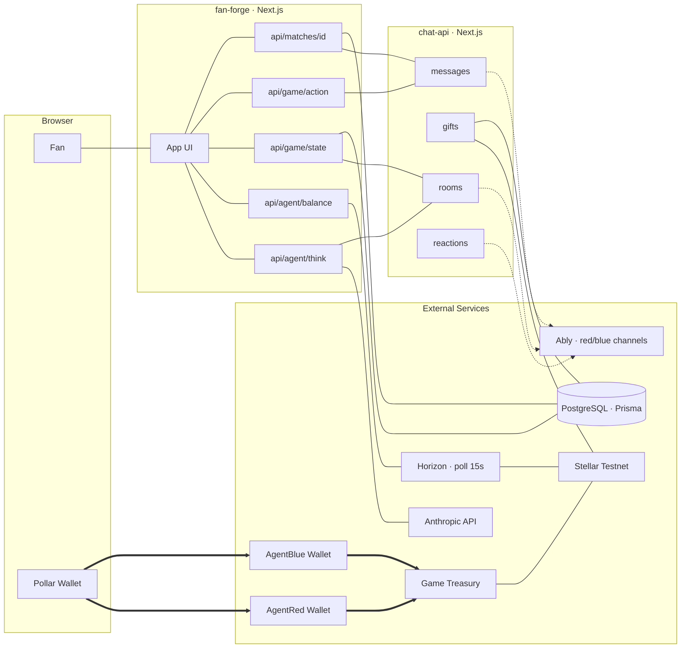

```mermaid
graph LR
    subgraph Browser
        FAN[Fan]
        WALLET[Pollar Wallet]
    end

    subgraph fanforge["fan-forge · Next.js"]
        APP[App UI]
        THINK["api/agent/think"]
        BAL["api/agent/balance"]
        GSTATE["api/game/state"]
        GACTION["api/game/action"]
        MATCH["api/matches/id"]
    end

    subgraph chatapi["chat-api · Next.js"]
        ROOMS["rooms"]
        GIFTS["gifts"]
        MSGS["messages"]
        REACT["reactions"]
    end

    subgraph External["External Services"]
        ANTHROPIC[Anthropic API]
        HORIZON["Horizon · poll 15s"]
        STELLAR[Stellar Testnet]
        AGRED[AgentRed Wallet]
        AGBLUE[AgentBlue Wallet]
        TREASURY[Game Treasury]
        ABLY["Ably · red/blue channels"]
        PG[(PostgreSQL · Prisma)]
    end

    FAN --- APP
    WALLET ==> AGRED
    WALLET ==> AGBLUE

    APP --- THINK
    APP --- BAL
    APP --- GSTATE
    APP --- GACTION
    APP --- MATCH

    THINK --- ANTHROPIC
    BAL --- HORIZON
    HORIZON --- STELLAR

    THINK --- ROOMS
    GSTATE --- ROOMS
    GACTION --- MSGS
    MATCH --- MSGS

    ROOMS -.-> ABLY
    MSGS -.-> ABLY
    REACT -.-> ABLY
    GIFTS --- STELLAR

    AGRED ==> TREASURY
    AGBLUE ==> TREASURY
    TREASURY --- STELLAR

    GSTATE --- PG
    MATCH --- PG
    GIFTS --- PG
```
